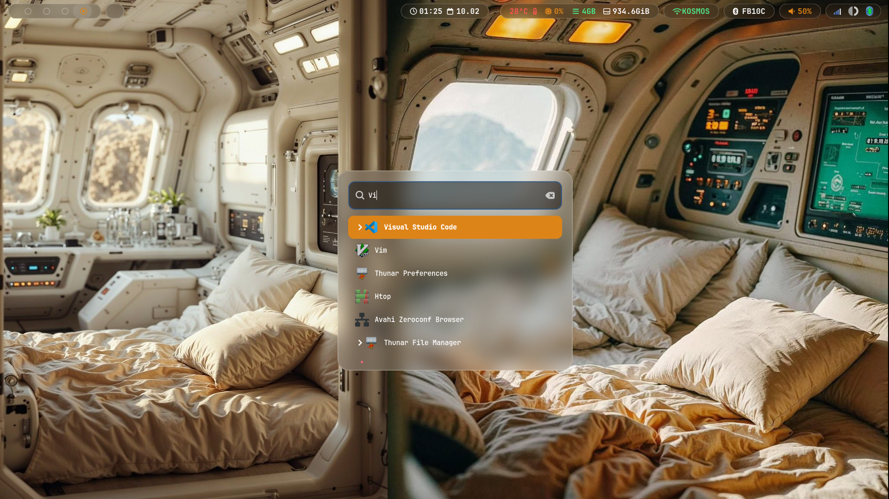
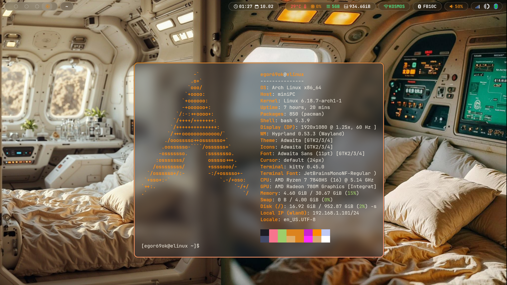
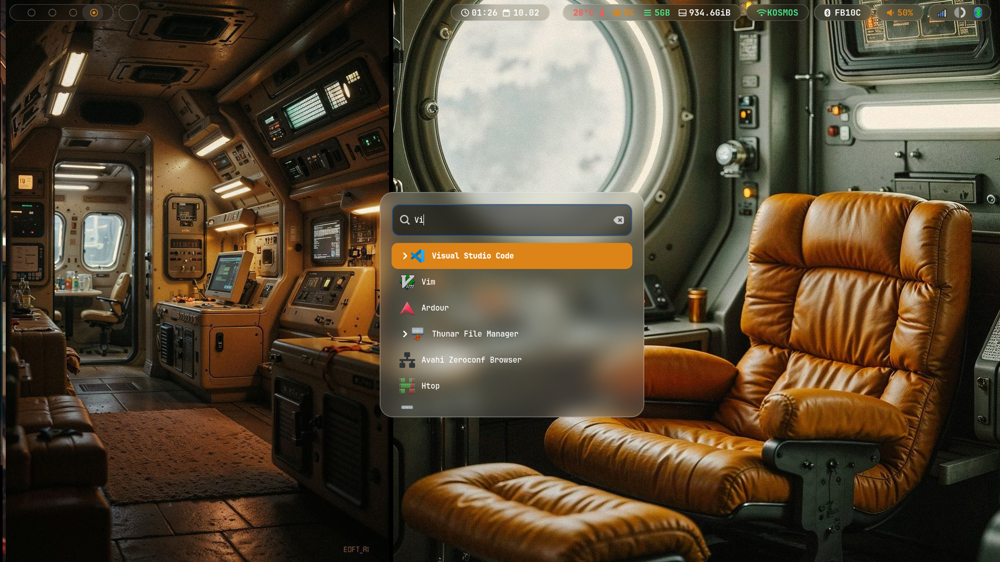
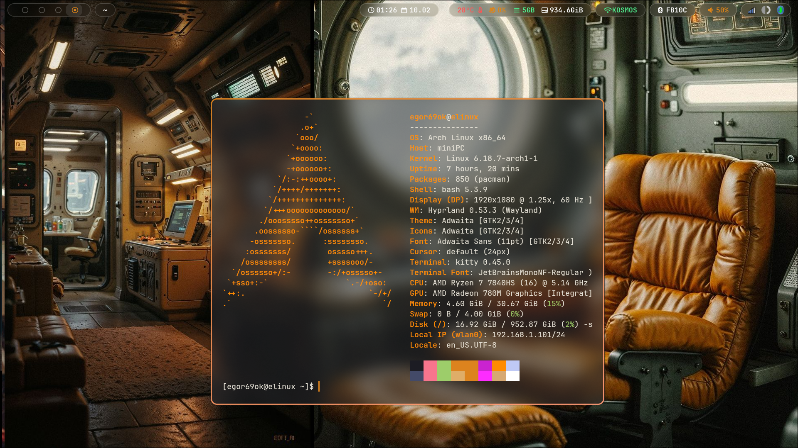
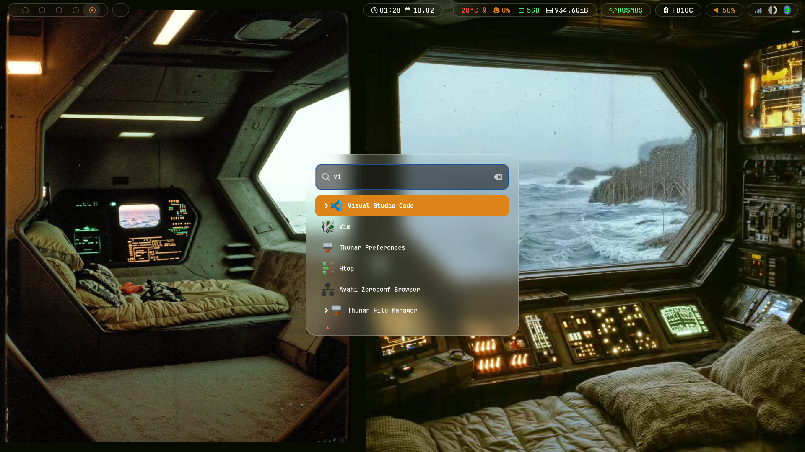
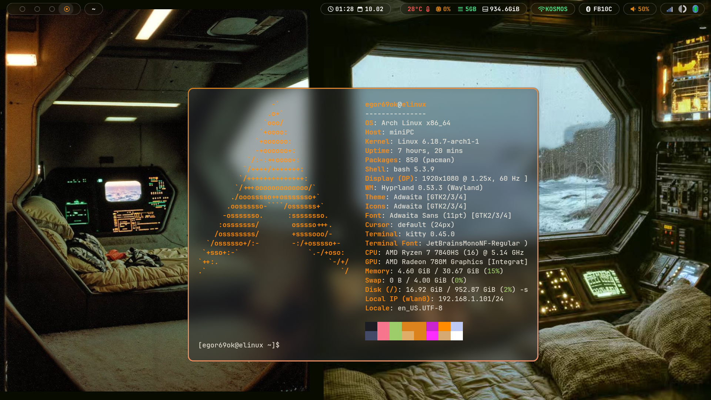

# Hyprland Space Retro Full HD
Hyprland Space Retro








# 🐧 Hyprland Space Retro Config

<p align="center">
  
  
  
</p>

---

## ⌨️ Keybindings

In this configuration, the **SUPER** key (Windows Key) is represented by the <kbd>🐧</kbd> icon.

### 🚀 Core Applications
| Action | Keybinding | Description |
| :--- | :--- | :--- |
| 💻 **Terminal** | <kbd>🐧</kbd> + <kbd>Enter</kbd> | Launch Kitty Terminal |
| ❌ **Close** | <kbd>🐧</kbd> + <kbd>Q</kbd> | Kill active window |
| 🌐 **Browser** | <kbd>🐧</kbd> + <kbd>N</kbd> | Open Firefox |
| 💬 **Telegram** | <kbd>🐧</kbd> + <kbd>T</kbd> | Open Telegram |
| 📂 **Files** | <kbd>🐧</kbd> + <kbd>E</kbd> | Open Thunar File Manager |
| 🔍 **App Menu** | <kbd>🐧</kbd> + <kbd>D</kbd> | Launch Wofi (drun) |
| 📺 **Fullscreen** | <kbd>🐧</kbd> + <kbd>Shift</kbd> + <kbd>F</kbd> | Toggle Fullscreen mode |
| 🧊 **Floating** | <kbd>🐧</kbd> + <kbd>Alt</kbd> + <kbd>F</kbd> | Toggle Floating mode |
| 🚪 **Exit** | <kbd>Ctrl</kbd> + <kbd>Alt</kbd> + <kbd>Delete</kbd> | Exit Hyprland session |

### 📸 Screenshots & Utilities
| Action | Keybinding | Description |
| :--- | :--- | :--- |
| 🔒 **Lock** | <kbd>Ctrl</kbd> + <kbd>Alt</kbd> + <kbd>L</kbd> | Lock screen via Swaylock |
| 🖼️ **Wallpaper** | <kbd>Ctrl</kbd> + <kbd>Alt</kbd> + <kbd>W</kbd> | Change wallpaper script |
| 📸 **Screen** | <kbd>Print</kbd> | Capture full screen |
| ✂️ **Area** | <kbd>🐧</kbd> + <kbd>Shift</kbd> + <kbd>S</kbd> | Area Snipping (Grim/Slurp) |
| 🔄 **Bar** | <kbd>🐧</kbd> + <kbd>Shift</kbd> + <kbd>R</kbd> | Restart Waybar |

### 🧭 Navigation & Workspaces
| Action | Keybinding | Description |
| :--- | :--- | :--- |
| 🎯 **Focus** | <kbd>🐧</kbd> + <kbd>Arrows</kbd> | Move window focus |
| 🚚 **Move** | <kbd>🐧</kbd> + <kbd>Ctrl</kbd> + <kbd>Arrows</kbd> | Move window position |
| 📐 **Resize** | <kbd>🐧</kbd> + <kbd>Shift</kbd> + <kbd>Arrows</kbd> | Resize active window |
| 🔢 **Workspaces** | <kbd>🐧</kbd> + <kbd>1-0</kbd> | Switch to workspace |
| 🏗️ **Move to WS** | <kbd>🐧</kbd> + <kbd>Shift</kbd> + <kbd>1-0</kbd> | Move window to workspace |
| 📥 **Scratchpad** | <kbd>🐧</kbd> + <kbd>U</kbd> | Toggle special workspace |

---

## 🛠️ Installation & Dependencies

To ensure everything works as intended, please install the following packages:

```bash
sudo pacman -S hyprland kitty wofi thunar waybar swaylock grim slurp swappy


